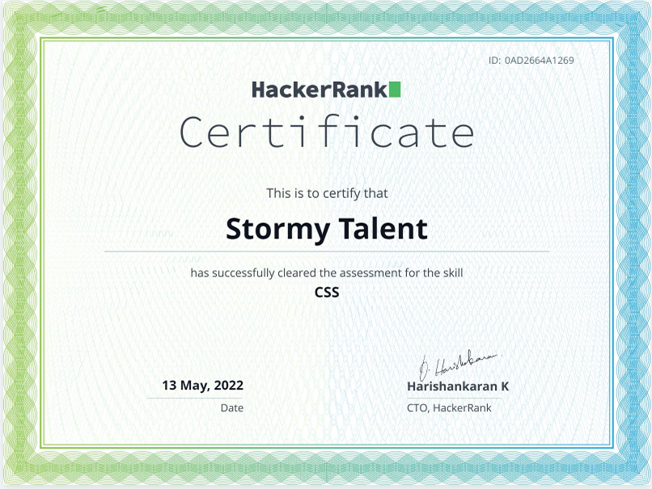
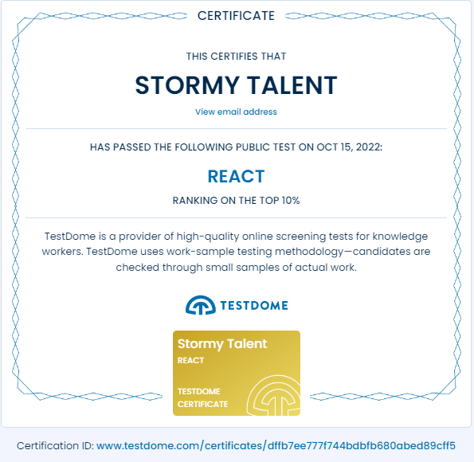
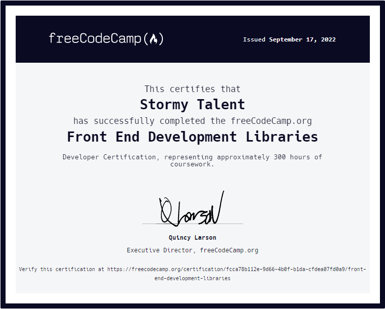
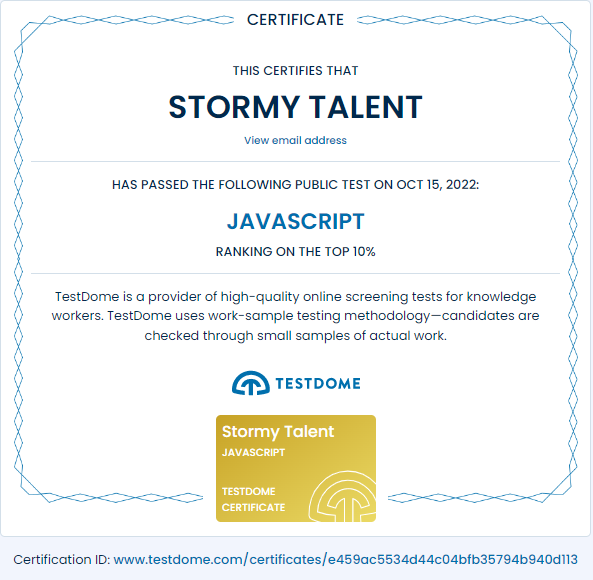

<h1 align="center">- STORM IN TALENTS -</h1>
<h4 align="center">
  He has got strong <b>TALENT</b> in his heart. 
  Whenever his <b>TALENT</b> encounters a <b>STORM</b>, working with him will yield awesome results. 
  He's always with STORM in TALENT. 
</h4>

             

  
    
  

  
  
    

  
  

             

